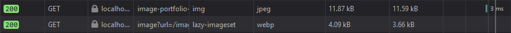
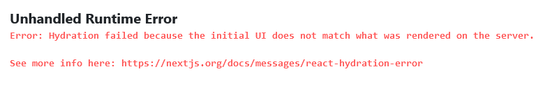
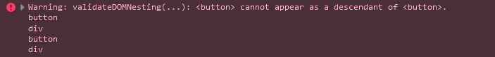
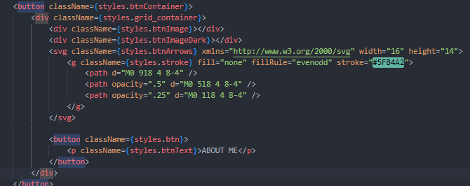
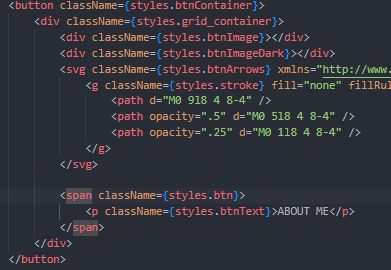

//hamburger menu

# Mobile First Responsive Product preview card component

## Table of contents

-   [Overview](#overview)
    -   [The challenge](#the-challenge)
    -   [Screenshots](#screenshots)
    -   [Links](#links)
-   [My process](#my-process)
    -   [Built with](#built-with)
    -   [What I learned](#what-i-learned)
    -   [Continued development](#continued-development)
    -   [Useful resources](#useful-resources)
-   [Author](#author)
-   [Acknowledgments](#acknowledgments)

## Overview

### The challenge

This challenge was to make a portfolio website with a minimalist design. Currently using React, NextJs and Css Modules for styling. I used a Mobile first approach for a responsive site.

Users should be able to:

-   View the optimal layout depending on their device's screen size
-   See hover and focus states for interactive elements

### Screenshots

### Links

-   Solution URL: [Github]()
-   Live Site URL: [Netlify Page]()

## My process

### Built with

-   Semantic HTML5 markup
-   CSS custom properties
-   Tailwind
-   Flexbox
-   Grid
-   Mobile-first workflow

### What I learned

NextJs will actually optimize your images for you with their Image component which uses browser native lazy loading.

The Image component will optimize images based on screen sizes as well!

At one point I ended up getting a warning stating Hydration had failed.

After looking through the error message I noticed that certain elements are not allowed to be nested.

In this case it was a button element being nested inside another button element.
Looking through my code I did see a button nested inside another button.

I ended up changing the button element to a span and it fixed the problem right away! If you end up with a hydration error, read the error message and check for unwanted nesting of elements.

### Continued development

### Useful resources

-   [Hamburger Menu Research](https://ibaslogic.com/how-to-add-hamburger-menu-in-react/) - A good overview how to go about implementing a hamburger menu in react.

-   [Importing Fonts for NextJs](https://nextjs.org/docs/api-reference/next/font) - NextJs docs on next/font and how to apply custom fonts to your documents.

-   [Netflify Page Deployment](https://www.netlify.com/) - I use Netlify for deploment because I found github pages can sometimes be buggy.

-   [Active Link Colors](https://www.slingacademy.com/article/how-to-highlight-currently-active-link-in-next-js/) - Great for setting active link colors using the useRouter hook with nextjs.

## Author

-   GitHub - [@NicholasAnich](https://github.com/NicholasAnich)
-   LinkedIn - [@NicholasAnich](https://www.linkedin.com/in/nick-anich/)
-   Frontend Mentor - [@NicholasAnich](https://www.frontendmentor.io/profile/yourusername)

## Acknowledgments
